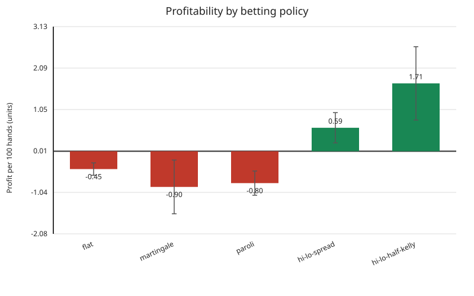
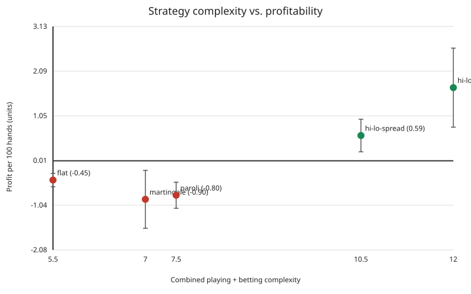

# Betting strategy comparison

Playing decisions and wager sizing are modeled independently. Every benchmark below
uses the same basic playing strategy and seeded shoe sequence, so payout differences
come from wager timing and sizing rather than different cards.

## Policies

| Policy | Betting complexity | Behavior |
| --- | ---: | --- |
| Flat | 0.5 | Always bets one unit |
| Martingale | 2.0 | Doubles after a loss, capped at 12 units |
| Paroli | 2.5 | Doubles after wins for up to two progressions |
| Hi-Lo spread | 5.5 | Bets 1/2/4/8/12 units from floored true-count tiers |
| Hi-Lo half-Kelly | 7.0 | Uses an approximate count-derived edge and bankroll fraction, capped at 12 units |

The plotted complexity value adds the basic playing-strategy score of 5.0 to the
betting score. These are transparent ordinal research scores, not measured units of
human cognitive effort.

## Reproducible benchmark

```bash
PYTHONPATH=src python -m blackjack_sim \
  --strategy basic --betting all \
  --rounds 2000000 --seed 20260715 \
  --bankroll 100000 --min-bet 1 --max-bet 12 \
  --csv docs/generated/betting-results.csv \
  --scatter docs/generated/complexity-vs-profitability.svg \
  --bar-plot docs/generated/betting-profitability.svg
```

| Policy | Profit/100 hands | 95% interval | Edge on wagered money | Max drawdown |
| --- | ---: | ---: | ---: | ---: |
| Flat | -0.449 | [-0.605, -0.293] | -0.407% | 9,685.5 |
| Martingale | -0.898 | [-1.574, -0.222] | -0.276% | 23,379.5 |
| Paroli | -0.802 | [-1.107, -0.497] | -0.434% | 17,461.5 |
| Hi-Lo spread | 0.590 | [0.209, 0.971] | 0.347% | 2,234.5 |
| Hi-Lo half-Kelly | 1.707 | [0.785, 2.630] | 0.422% | 4,963.0 |





The confidence bars are important. Progression systems change variance and the amount
at risk, but past wins or losses do not predict the next independent hand and therefore
do not create an advantage. In this run Martingale lost more units and had the largest
drawdown. The count-based policies became profitable by staking more only when visible
card depletion indicated a favorable shoe.

The half-Kelly policy uses a deliberately simple approximation: estimated player edge
is 0.5 percentage points per true-count point above +1, divided by a fixed variance
estimate, halved, and constrained by table limits. It is not an exact Kelly solution
and should be treated as the more sophisticated benchmark in this iteration.

Raw results are available as
[CSV](generated/betting-results.csv) and
[JSON](generated/betting-results.json).
