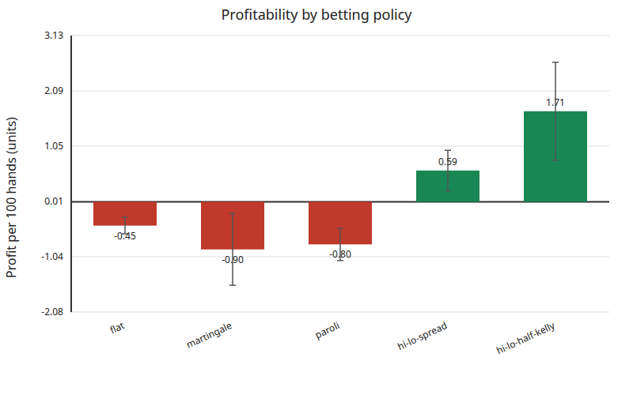
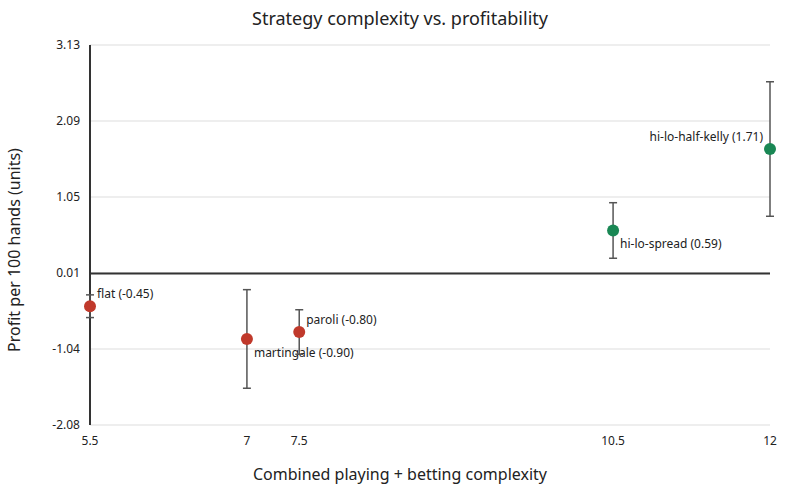

# Benchmark figure gallery

This directory contains the reproducible outputs from the two-million-round betting
strategy comparison.

## Animated summary

The animation transitions between profitability by betting policy and profitability
versus combined strategy complexity.


## Static figures

### Profitability by betting policy



### Complexity versus profitability



The error bars show approximate 95% Monte Carlo confidence intervals. Green marks
positive simulated profit and red marks negative simulated profit.

## Source artifacts

- [Profitability chart as SVG](betting-profitability.svg)
- [Complexity scatter plot as SVG](complexity-vs-profitability.svg)
- [Benchmark results as CSV](betting-results.csv)
- [Benchmark results as JSON](betting-results.json)

## Rebuild the animation

Install Pillow and run the animation script from the repository root:

```bash
python3 -m pip install --upgrade Pillow
python3 scripts/render_plot_animation.py \
  docs/generated/betting-profitability.png \
  docs/generated/complexity-vs-profitability.png \
  docs/generated/betting-strategy-summary.gif
```
